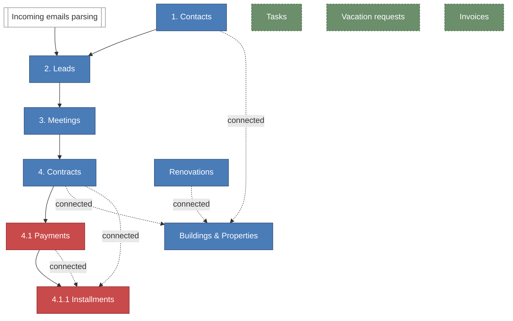

# /specs — Index

One-file orientation for anyone (human or Claude) entering this codebase. Read this first. Load individual specs only when working on that module.

## What this project is
Internal ERP for **vminvest** — a Bulgarian construction company (~25 people, Sofia). Replaces a patchwork of Excel, email, and institutional memory with one Next.js + Supabase system.

Entry point for tooling and conventions: `/CLAUDE.md` at the repo root.
Full company + compliance context: `_foundations/context.md`.

## Module map
The spine of the app: Contacts → Leads → Meetings → Contracts → Payments → Installments. Dashed edges are "connected boards"-style relations (bidirectional, previewable — see `_foundations/ui-patterns-relations.md`). Solid edges are parent-child flow. Nodes in blue are **main modules** (top-level nav); nodes in red are **sub-modules** (accessed through their parent).



**Legend**
- **Main module (blue)** — top-level item in the nav bar.
- **Sub-module (red)** — accessed through its parent module's detail view, not the main nav.
- **Standalone (dashed green)** — not part of the Contacts spine. Own nav entry, independent data.
- **System (white)** — non-user module (automation, background process).

## How to navigate this folder
- **Starting a module?** Load the module's spec + the foundation specs it explicitly references. Don't load everything.
- **Unsure about a pattern?** Default to `_foundations/` or `design-system/`. If still unclear, check `decisions.md`.
- **Want to understand a weird-looking choice in the code?** Check `decisions.md` first.

## Cross-cutting specs (foundations)
These rules apply to every module. If a module spec conflicts with a foundation, the foundation wins.

| File | What it covers | Status |
|---|---|---|
| `_foundations/context.md` | Company, locale (bg-BG, EUR, DD.MM.YYYY), compliance (GDPR, ЕГН), team structure, tech stack. | ✅ |
| `_foundations/authentication.md` | Supabase Auth, invite-based flow, sessions, password rules. | ✅ |
| `_foundations/roles.md` | Admin / manager / user permission matrix, per module. | ✅ |
| `_foundations/ui-patterns-relations.md` | How records link across modules. Bidirectional, previewable, with mirror columns. | ✅ |
| `_foundations/ui-patterns-inline-edit.md` | How every table cell gets edited in place. Status popovers, optimistic UI, per-field permissions. | ✅ |
| `_foundations/audit-log.md` | What gets logged, log entry shape, module emission pattern, payload conventions, PII redaction, retention. | ✅ |
| `_foundations/activity-feed.md` | Per-record narrative surface — manual notes + system events merged in one feed; polymorphic ActivityNote model; @mentions with Resend; covers all major entities. Phase 1.A + 1.B + 1.B-mentions + 1.C + 1.D shipped (Contact / Lead / Meeting / Task / Invoice / Contract / Property all wired with per-module write gates). Remaining: Renovation (2.A, with the renovations Phase 2 implementation). | ✅ |
| `_foundations/bg-copy.md` | Canonical Bulgarian strings — button labels, confirmations, empty states, validation errors, toasts, plurals, locked-field tooltips. | ✅ |

## Design system
Visual and structural component specs. Load when building any UI.

| File | What it covers | Status |
|---|---|---|
| `design-system/tokens.md` | Colors, spacing, radii, typography, shadows. Single source of truth for visual values. | ✅ |
| `design-system/aesthetic.md` | Overall look-and-feel direction (Attio/Pylon sensibility). | ⏳ Pending |
| `design-system/buttons.md` | Button system (sizes, variants, states). | ⏳ Pending (referenced by inputs, modals) |
| `design-system/inputs.md` | Form controls — text, select, checkbox, date, etc. | ✅ |
| `design-system/modals.md` | Dialog patterns, sizes, motion, keyboard. | ✅ |
| `design-system/tables.md` | Base table conventions (header, rows, alignment, density). | ⏳ Pending |
| `design-system/tables-advanced.md` | Expandable rows, grouping, aggregation, tree tables, frozen headers. | ✅ |

## Business domain modules

Core data model follows a parent → child chain. **Contacts is the root.**

```
Contact
  └─ Lead
      └─ Meeting
          └─ Contract → Property
              └─ Payment
                  └─ Installment
```

Plus standalone modules for Tasks, Renovations, and Absence Requests.

`Spec` = the markdown document is written and reviewed. `Impl` = the module is actually built in the codebase. A spec being ✅ doesn't mean the code exists. Status legend:

- ✅ — written / shipped
- 🟡 — partial — see Notes column for what's missing
- ⏳ — pending / not started

| File | Module | Depends on | Phase | Spec | Impl | Notes |
|---|---|---|---|---|---|---|
| `contacts.md` | Contacts — root entity for every person/company. | — | Phase 1 | ✅ | ✅ | List + detail + edit + create + inline owner edit. |
| `properties.md` | Properties — catalogue of all units the company has built. | — (linked by Contracts in Phase 2) | Phase 1 | ✅ | ✅ | List + detail + edit + CSV import + status history + admin/buildings. Sellers now `String[]` with rule-based canonicalisation on every write — bulk-merge admin screen retired. |
| `leads.md` | Leads — sales prospects. | Contacts | Phase 1 | ✅ | 🟡 | List + detail + inbox + Resend webhook ingest. **Phase 2-C deferred**: production email-source routing is paused. |
| `meetings.md` | Meetings — scheduled conversations with leads. | Contacts, Leads | Phase 1 | ✅ | ✅ | List + detail + edit + create + calendar view. |
| `contracts.md` | Contracts — the deal. Writes to Properties (owner, status). | Contacts, Properties | Phase 1 | ✅ | ✅ | List + detail + 872-row CSV import + manual create/edit + file attachments (uploads open to all roles, delete admin-only) + carryover calc. Template-driven document generation deliberately out of scope — team prepares files externally and uploads. |
| `payments.md` | Payments — up to 4 milestones per contract. | Contracts | Phase 1 | ✅ | 🟡 | `ContractPayment` model + display embedded in `/contracts/[id]`. Now also drivable from the contract create/edit form via the percent-breakdown section. No standalone module page — by design, payments live inside the parent contract. |
| `installments.md` | Installments — up to 3 per payment, max 12 per contract. | Payments | Phase 1 | ⏳ | 🟡 | `ContractInstallment` model + display embedded in `/contracts/[id]`. No standalone module / spec. |
| `tasks.md` | Tasks — personal and team. | — | Phase 1 | ✅ | ✅ | Standalone (no entity links by design). Tabs Мои / Всички / Завършени. Inline status + owner edit. Title/description/due-date via /new + /edit forms. Admin-only delete. |
| `renovations.md` | Renovations — projects on owned properties, template-driven activity model + cross-portfolio team-capacity check. | Properties | Phase 2 | ✅ | ✅ | Pivoted + reshipped 20.05.2026 (5 rounds). Admin catalogs (`/admin/renovations/{activities,teams}`) seeded from the Excel — 29 activities + 7 teams. Create flow chain-loads activities from the catalog (size + bathroom-multiplier aware). Detail page has inline-editable activity list + read-only Gantt + per-team capacity strip overlay. Portfolio Gantt + KPI tile + "Само с превишен капацитет" list filter all share one capacity computation. 5 KPI tiles. Future: drag-to-reschedule (Phase 2.5), notifications (Phase 2.5), working-day calendar (deferred). |
| `absence.md` | Absence Requests — vacation, leave, etc. | Users only | Phase 1 | ✅ | ✅ | Submit + calendar + inbox + admin calendar + working-days calc + admin dashboard with 5 KPIs (`/admin/absence`). |
| `invoices.md` | Invoices — inbound supplier-invoice intake, parsing, anomaly detection. | — | Phase 1 | ✅ | ✅ | Section admin + per-section upload with Claude PDF parsing + preview modal + detail page with split-screen PDF and inline-editable header/line items + price anomaly detector (5% / 30d) + dashboard KPIs + full filter bar + pagination + file-cell preview. |
| `dashboard.md` | Admin/manager overview. | All | Deferred | ⏳ | ⏳ | |

## Build order
Follow the dependency graph. A module should not be started until its dependencies are at least schema-complete.

**Recommended order:**
1. Foundations (auth, roles, design tokens, formatters, validators, seed script)
2. **Contacts** (roots everything)
3. **Properties** (independent of Contacts in Phase 1; write schema that accommodates Contracts linking in Phase 2)
4. **Leads** → **Meetings**
5. **Contracts** → **Payments** → **Installments**
6. **Tasks**
7. **Absence Requests**
8. **Renovations** (Phase 2)
9. **Dashboard** (deferred)

## Decision log
`decisions.md` — one line per non-obvious decision, dated. Read this before questioning any surprising choice in the code. Add to it whenever you make a non-obvious call — future you will thank current you.

Format:
```
[DD.MM.YYYY] — [decision] — [one-line reason]
```

## File structure on disk

```
/specs
  _index.md              ← you are here
  decisions.md
  _foundations/
    context.md
    authentication.md
    roles.md
    ui-patterns-relations.md
    ui-patterns-inline-edit.md
    audit-log.md
    activity-feed.md
    bg-copy.md            (pending)
  design-system/
    tokens.md
    aesthetic.md          (pending)
    buttons.md            (pending)
    inputs.md
    modals.md
    tables.md             (pending)
    tables-advanced.md
  contacts.md
  properties.md
  leads.md
  meetings.md
  contracts.md
  payments.md
  installments.md         (pending)
  tasks.md                (pending)
  renovations.md
  absence.md
  invoices.md
  dashboard.md            (deferred)
```
